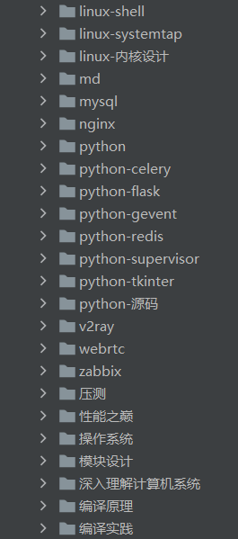

# 最全的web爬虫基础知识

## *[网络](https://github.com/nwaiting/spider-base/tree/master/http)*

### *1、http网络知识*

http网络作为爬虫最基本的常识，在平常开发爬虫程序中会一直使用到。最基础的从tcp建立网络链接，然后进行http的封包，发送数据，接收数据，解析报文，解析出http的字段，
根据http的方法、参数等做不同的处理，这个流程是需要学习和熟悉的，在爬虫程序中，碰到最多的就是网络的问题，网络知识不熟练，爬虫的进阶就会很难。

#### [1.1 TCP/IP 网络模型有哪几层](https://xiaolincoding.com/network/1_base/tcp_ip_model.html)

#### [1.2 Linux 系统是如何收发网络包的](https://xiaolincoding.com/network/1_base/how_os_deal_network_package.html)

#### [1.3 http报文](https://github.com/woai30231/http/tree/master/%E7%AC%AC%E4%B8%89%E7%AB%A0%20HTTP%E6%8A%A5%E6%96%87) 

#### [1.4 http重定向与负载均衡](https://github.com/woai30231/http/tree/master/%E7%AC%AC%E4%BA%8C%E5%8D%81%E7%AB%A0%20%E9%87%8D%E5%AE%9A%E5%90%91%E4%B8%8E%E8%B4%9F%E8%BD%BD%E5%9D%87%E8%A1%A1)

#### [1.5 http客户端识别与Cookie机制](https://github.com/woai30231/http/tree/master/%E7%AC%AC%E5%8D%81%E4%B8%80%E7%AB%A0%20%E5%AE%A2%E6%88%B7%E7%AB%AF%E8%AF%86%E5%88%AB%E4%B8%8ECookie%E6%9C%BA%E5%88%B6)

#### [1.6 httpURL与资源](https://github.com/woai30231/http/tree/master/%E7%AC%AC%E4%BA%8C%E7%AB%A0%20URL%E4%B8%8E%E8%B5%84%E6%BA%90)

#### [1.7 键入网址到网页显示，期间发生了什么](https://xiaolincoding.com/network/1_base/what_happen_url.html)

### *2、web服务器*

web服务就是与爬虫交互的对象，理解和熟悉了web服务的流程和原理，对于爬虫会有更加深入的理解

#### [2.1 web服务器应该做些什么](https://github.com/woai30231/http/tree/master/%E7%AC%AC%E4%BA%94%E7%AB%A0%20web%E6%9C%8D%E5%8A%A1%E5%99%A8)

#### [2.2 使用flask写一个最简单的web服务](http://www.bjhee.com/flask-1.html)

### *3、nginx反向代理*

Nginx是一款轻量级的Web 服务器/反向代理服务器及电子邮件（IMAP/POP3）代理服务器，其占有内存少，并发能力强，整体性能非常强大，在web前端服务器目前是企业的首选。

#### [3.1 nginx到底是什么](https://cloud.tencent.com/developer/news/241412) 

#### [3.2 为什么需要用nginx](https://worktile.com/kb/ask/17623.html)

#### [3.3 初探nginx架构](http://tengine.taobao.org/book/chapter_02.html)

#### [3.4 nginx怎么用](https://bbs.huaweicloud.com/blogs/326032)

#### [3.5 Nginx 是如何启动并处理http请求的](https://juejin.cn/post/6844903655615758350)

## *[前端html](https://github.com/nwaiting/spider-base/tree/master/html)*

HTML全称为超文本标记语言（HyperText Markup Language），是一种用于创建网页的标准标记语言。
HTML是一种基础技术，常与CSS、JavaScript一起被众多网站用于设计网页、网页应用程序以及移动应用程序的用户界面。 网页浏览器可以读取HTML文件，并将其渲染成可视化网页。
HTML描述了一个网站的结构语义随着线索的呈现，使之成为一种标记语言而非编程语言。

### [1、html基础知识](https://github.com/LiHongyao/HTML)

### [2、html解析](https://www.cnblogs.com/qlqwjy/p/16518736.html)

## *[前端js](https://github.com/nwaiting/spider-base/tree/master/js)*

js全称是JavaScript，JavaScript 是开发人员用来制作交互式网页的编程语言。从刷新社交媒体馈送到显示动画和交互式地图，JavaScript 函数可以改善网站的用户体验。作为一种客户端脚本语言，它是万维网的核心技术之一。

### [1、js基础知识](https://developer.mozilla.org/zh-CN/docs/Learn/JavaScript/First_steps/What_is_JavaScript)

### [2、js分析](https://pythonjishu.com/nhhtxcqzdm/)

### [3、js加解密](https://pythonjishu.com/nhhtxcqzdm/)

### [4、js混淆和反混淆](https://segmentfault.com/a/1190000018732039)

## *[编程语言python](https://github.com/nwaiting/spider-base/tree/master/python)*

### [1、python编程实现爬虫](https://github.com/nwaiting/spider-base/tree/master/python)

### [2、ua介绍](https://github.com/nwaiting/spider-base/tree/master/python)

### [3、proxy介绍](https://github.com/nwaiting/spider-base/tree/master/python)

### [4、正则解析](https://github.com/nwaiting/spider-base/tree/master/python)

## *[工具chrome](https://github.com/nwaiting/spider-base/tree/master/chrome)*

### 1、定位请求

### 2、分析请求

### 3、模拟请求

## *[工具fiddler](https://github.com/nwaiting/spider-base/tree/master/fiddler)*

### 1、抓取请求

### 2、分析请求

### 3、模拟请求

## *[数据库](https://github.com/nwaiting/spider-base/tree/master/database)*

### 1、MySQL关系型数据存储

### 2、redis临时型数据缓存

### 3、mongodb文档型数据存储

## 加入学习圈子,相互交流,相互学习,相互分享
<figure>

</figure>

